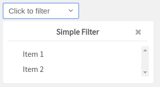
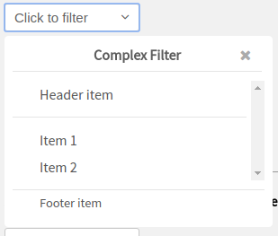

# Vue Dropdown Filter

The Vue.js Dropdown Filter is a simple component to render a stylized filter, inspired by the [gitlab.com](https://gitlab.com) filters. The component doesn't concern about server side operations, or make ajax calls. This kind of logic must be implemented by the developer, using the events provided by the component.

## Summary

- [Usage](#usage)
- [Options](#options)
- [Events](#events)

## Usage

```js
<dropdown
  title="Simple Filter"
  text="Click to filter"
  :items="[
    {text: 'Item 1'},
    {text: 'Item 2'}
  ]">
</dropdown>
```

This will render a simples dropdown:



To render a more complex dropdown, with header and footer you can use:

```js
<dropdown
  title="Complex Filter"
  text="Click to filter"
  :items="[
    {text: 'Item 1'},
    {text: 'Item 2'}
  ]"
  :header="[
    {text: 'Header item'}
  ]"
  :footer="[
    {text: 'Footer item'}
  ]">
</dropdown>
```

This will render a dropdown like this:



---

## Options

The component can be configured using options. The available options are:

#### text

The text that will be rendered on the button.

#### title

The title of the dropdown.

#### header

An array of items which will be rendered on the dropdown header section. Every item can must have a `text` key, and an optional `id` key. The `text` value will be presented to the user, and the `id` value will be returned when the used clicks on the header item. If no `id` was provided, the component will return the `text` itself. If no items are provided, the header section will not be rendered.

#### items

An array of items which will be rendered on the dropdown main section. Every item can must have a `text` key, and an optional `id` key. The `text` value will be presented to the user, and the `id` value will be returned when the used clicks on the header item. If no `id` was provided, the component will return the `text` itself.

#### footer

An array of items which will be rendered on the dropdown main section. Every item can must have a `text` key, and an optional `id` key. The `text` value will be presented to the user, and the `id` value will be returned when the used clicks on the header item. If no `id` was provided, the component will return the `text` itself. If no item are provided, the footer section will not be rended.

#### searchable

A boolean indicating if the component can be searchable. If true, the component will render a text input above the header section. Defaults to **false**.

#### isLoading

A boolean indicating if the component is in a loading state. If true, the component will render a loading indicator in the component body. Defaults to **false**.

#### bottomMessage

A string with a message which will be rendered on the bottom of the items section. This can be useful when retrieving more items from the server. Defaults to an empty string.

#### multiple

A boolean indicating if the user can select multiple options from the filter. Defaults to **false**.

---

## Events

The component emits various events, which can be used to create interaction between the filter and the server. The list of events emitted by the component is listed below:

#### filter-bottom-was-reached

Emmited whenever the user scrolls the main item section until the bottom. This event can be useful when we want to load more items to the dropdown, like when using a paginated set of items.

#### filter-selected

Emmited whenever the user clicks on a header item or in a main item. When clicking in the main section items, if the dropdown accepts multiple selection, the event will send an array with the selected items, if not, it will send just the selected item. When clicking on the header items, the event will always send a single item.

#### footer-was-clicked

Emmited whenever the user clicks on a footer item. This event always sends just the clicked item, even if the dropdown accepts multiple selection.

#### filter-input

Emmited whenever the user types something on the search field.

#### filter-closed

Emmited whenever the user closes the filter.

#### filter-opened

Emmited whenever the user opens the filter.
